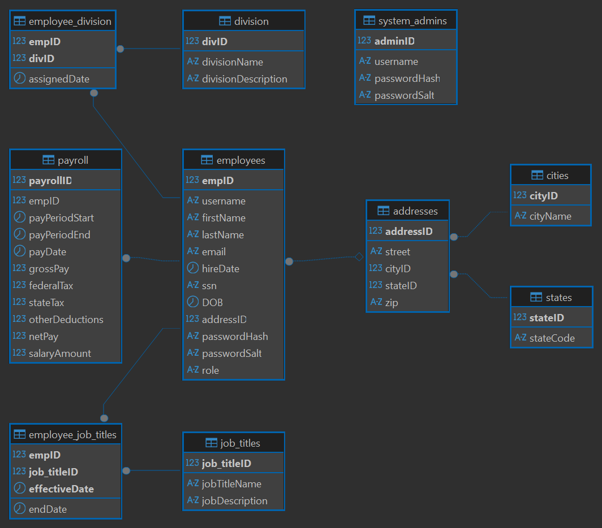
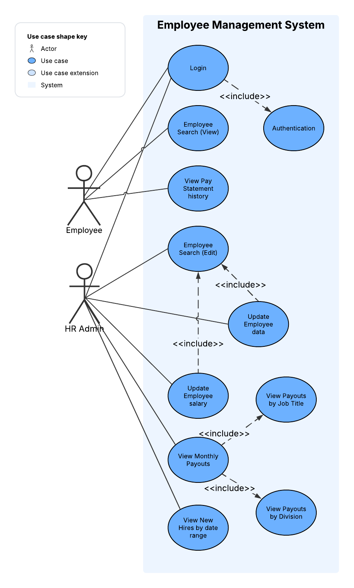
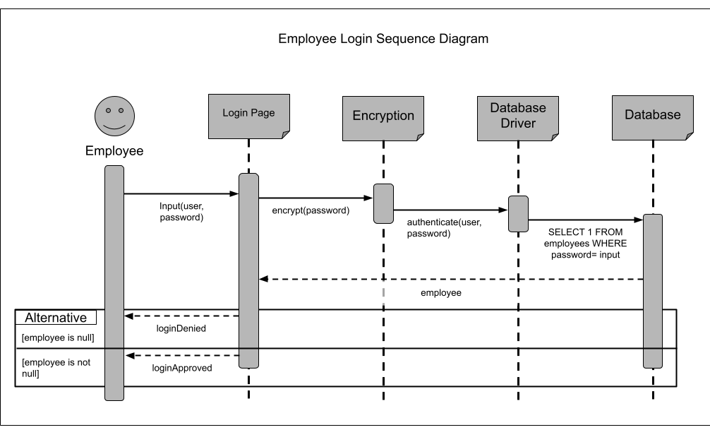
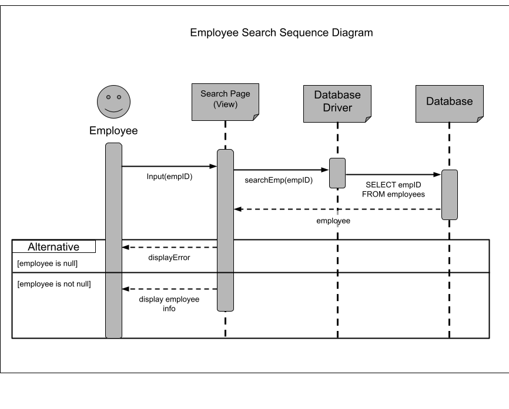
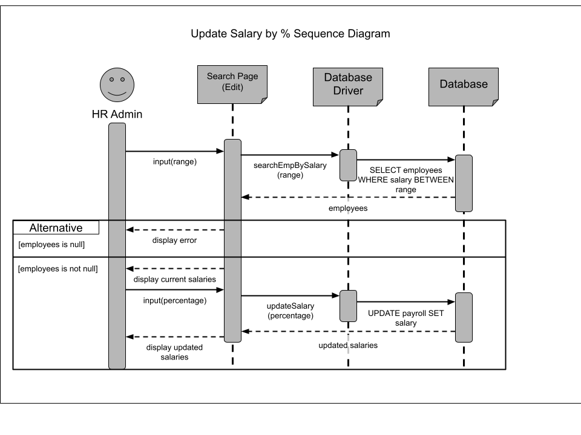

# Employee Management System (EMS)

A console-based Employee Management System built for **Company Z**, developed for CSc 3350 (Dev Team 42: Clinton Burns, Vince Paul, Amari Booth).

The system replaces manual MySQL scripting with a structured Java application backed by a relational database. It supports two roles — **HR Admins**, who manage employee records, salaries, and reporting, and **Employees**, who can view their own personal and payroll information.

## Features

- Secure login that cross-references credentials against the employee/admin database
- Role-based access (System Admin vs. general Employee)
- Employee search by name, SSN/DOB, or employee ID
- Admin-driven employee record updates through a single interface
- Bulk salary updates by percentage for a given salary range
- Employee deletion after search (admin only)
- Pay statement history, sorted by most recent date
- Monthly pay reports grouped by job title and by division
- New-hire reports by date range
- Input validation for fields like SSN, zip code, and salary values

## Tech Stack

- **Java** — application logic (`src/`)
- **MySQL** — data storage (`src/resources/db/`)
- **JDBC** (`mysql-connector-j`) — database connectivity (`lib/`)

## Project Structure

```
src/
├── EMS.java                     # Entry point, menus, login flow
├── Employee.java                # Employee model
├── EmpDataAccess.java           # Employee queries (search, update, new hires, etc.)
├── PayrollDataAccess.java       # Payroll queries (salary raises, pay history, reports)
└── resources/
    ├── HashGenerator.java       # Password hashing utility
    ├── MakeEmployee.java        # Employee object helper
    └── db/
        ├── ems_create_mysql.sql # Database schema
        └── ems_insert_mysql.sql # Seed data
lib/
└── mysql-connector-j-9.1.0.jar  # JDBC driver
```

## Database Schema

Key tables: `employees`, `payroll`, `division`, `employee_division`, `job_titles`, `employee_job_titles`, `addresses`, `cities`, `states`, and `system_admins`, related through primary/foreign keys.



## Design Diagrams

**Use Case Diagram** — actors (Employee, HR Admin) and their available actions:



**Sequence Diagrams** — Employee Search, Update Salary by %, and Add New Employee flows:





## Setup

1. Install MySQL and create the schema:
   ```
   mysql -u root -p < src/resources/db/ems_create_mysql.sql
   mysql -u root -p < src/resources/db/ems_insert_mysql.sql
   ```
2. Update the connection constants in [EMS.java](src/EMS.java) (`URL`, `DB_USER`, `DB_PASS`) to match your local MySQL instance.
3. Compile and run with the JDBC driver on the classpath:
   ```
   javac -cp lib/mysql-connector-j-9.1.0.jar -d out src/*.java src/resources/*.java
   java -cp "out;lib/mysql-connector-j-9.1.0.jar" EMS
   ```

## Testing

Manual test cases cover employee data updates, invalid input handling (e.g. malformed zip codes), employee deletion, and ranged salary updates. See the project's [Software Design Document](docs/CSC%203350%20Group%20Project%20SDD.pdf) for the full test case list.
